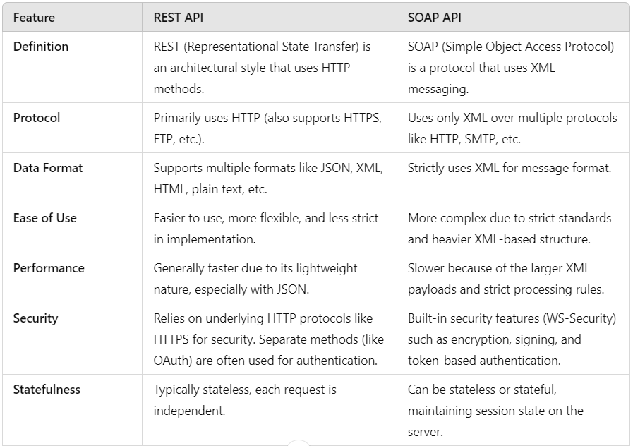
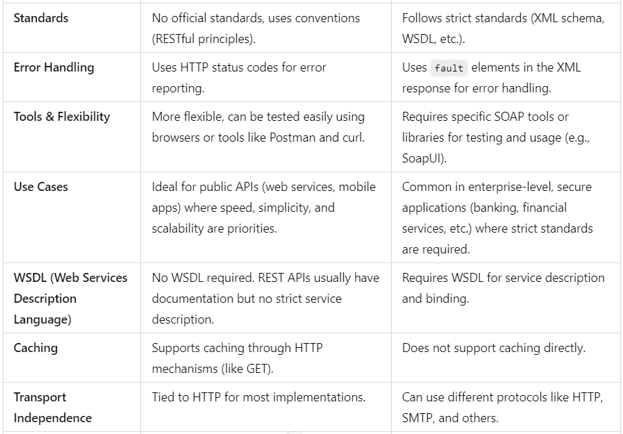
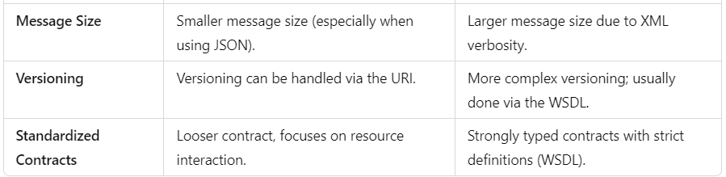

Here’s a comparison between REST API and SOAP API in tabular format:

In summary, REST APIs are more flexible, easier to work with, and ideal for lightweight, fast, and stateless applications, while SOAP APIs offer more standardized and robust solutions for highly secure and structured applications.